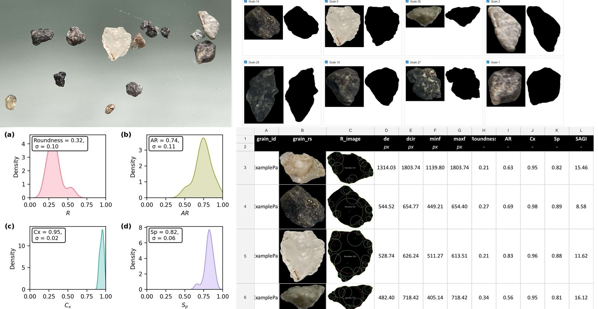

# fastGRAINS: Grain Shape Analysis Tool

fastGRAINS is an open‐source, automated tool designed to extract detailed grain size and shape descriptors from smartphone images. It supports geotechnical applications by providing rapid, reproducible analyses and generating comprehensive spreadsheets with measurement data.

## Google Colab Notebooks

### 1. Grain Segmentation & Shape Descriptor Calculation
This notebook automates the segmentation of grain images and computes key shape descriptors, such as:
- Shape metrics (Roundness, aspect ratio, convexity, and sphericity)

It outputs an Excel file summarizing the results, along with visual representations of each analysis.  
[](https://colab.research.google.com/github/camedinak24/fastGRAINS25/blob/main/FastGRAINS.ipynb)

### 2. Camera Calibration & Distortion Correction
This notebook guides you through calibrating your smartphone camera by using a printed or displayed chessboard pattern. It detects chessboard corners, computes calibration parameters, and then applies these parameters to correct lens distortion in your photographs. The calibration process ensures that shape measurements are accurate and reliable.  
[](https://colab.research.google.com/github/ckuncarm/fastGRAINS25/blob/main/Calibration_Unidstortion_Notebook.ipynb)

## 📋 Overview

This repository contains the implementation of the manuscript titled **"Using a Smartphone Device to Quantify Particle Size and Shape Descriptors"** (November 2024). fastGRAINS provides an open-source, automatic procedure to obtain particle size and shape descriptors through 2D image processing using a smartphone device.

## ✨ Key Features

- 📱 Automatic grain shape analysis using smartphone images
- 🔧 Requires only a simple initial calibration of the camera lens
- 📊 Generates spreadsheets with detailed particle size and shape descriptors
- 🏗️ Supports geotechnical applications through morphological characterization
- ✅ Validated with known critical state parameter samples

## 👨‍💻 Implementation

The code was developed by **Carlos Kuncar Medina** as part of his MSc research at Universidad de Concepción, Chile. The research was conducted under the supervision of Dr. Daniella Escribano and Dr. Gonzalo Montalva Alvarado.

## 👥 Authors

**Daniella Escribano, PhD**
- Department of Civil Engineering, Universidad de Concepción, Chile
- Fondecyt Iniciación Nº11241067, ANID, Chile
- Email: describano@udec.cl
- ORCID: 0000-0003-2014-9008

**Carlos Kuncar Medina, MSc.**
- Department of Civil Engineering, Universidad de Concepción, Chile
- Email: camedina2017@udec.cl
- *Lead developer of the fastGRAINS codebase*

**Gonzalo Montalva Alvarado, PhD**
- Department of Civil Engineering, Universidad de Concepción, Chile
- EASER Project ACT240044, ANID, Chile
- Email: gmontalva@udec.cl
- ORCID: 0000-0001-8598-7120

## 🚀 Getting Started

### Running the Notebook

1. **Option 1: Run in Google Colab**
   - Click the "Open in Colab" button at the top of this README
   - The notebook will open in Google Colab with all necessary dependencies
   - Follow the step-by-step instructions in the notebook

### Required Dependencies

The notebook requires the following main packages:
```
numpy
opencv-python
scipy
pandas
scikit-image
matplotlib
openpyxl
```

## 📊 Output Description

The analysis produces an Excel file with the following parameters for each grain:

### Identification and Images
- Unique grain identifiers
- Visual representations of analysis results

### Size Measurements (in pixel units)
- Diameter of largest inscribed circle
- Diameter of smallest circumscribed circle
- Minimum and maximum Feret diameters
- Major and minor axis lengths

### Shape Descriptors
- Equivalent diameter
- Roundness (Zheng & Hryciw, 2015)
- Aspect Ratio
- Convexity
- Various sphericity measures (Area, Circular ratio, Diameter, Perimeter, Width-to-Length ratio)

## 🔬 Applications

The tool benefits the geotechnical community by:
- Providing rapid assessment of grain morphology
- Establishing connections between particle shape and mechanical properties
- Complementing traditional experimental programs

## 🔍 Example Results
``
<p align="center">
  
</p>

## 🧰 Third-Party Tools and Acknowledgments

### Shape Analysis Implementation
The roundness calculation implemented in this notebook is based on the Matlab code by Zheng and Hryciw (2015):

Zheng, J., & Hryciw, R. D. (2015). Traditional soil particle sphericity, roundness and surface roughness by computational geometry. Géotechnique, 65(6), 494-506.

We thank the authors for their contributions to the field and for providing the basis for our implementation.

### AI-Powered Image Processing
This project utilizes state-of-the-art AI models for background removal and image segmentation:

- [RMBG-1.4](https://huggingface.co/briaai/RMBG-1.4) - For clean background removal from grain images
- [Fast Segment Anything](https://github.com/CASIA-IVA-Lab/FastSAM) - For efficient and accurate grain segmentation

These tools significantly enhance the automation capabilities of our pipeline and improve the accuracy of the shape analysis.

## 📝 Citation

If you use this tool in your research, please cite:
```
Escribano, D., Kuncar Medina, C., & Montalva Alvarado, G. (2024). Using a Smartphone Device to Quantify Particle Size and Shape Descriptors. [Journal information pending]
```

## 📜 License

()

##  Acknowledgments

This research was supported by Fondecyt Iniciación Nº11241067 and EASER Project ACT240044, ANID, Chile.
